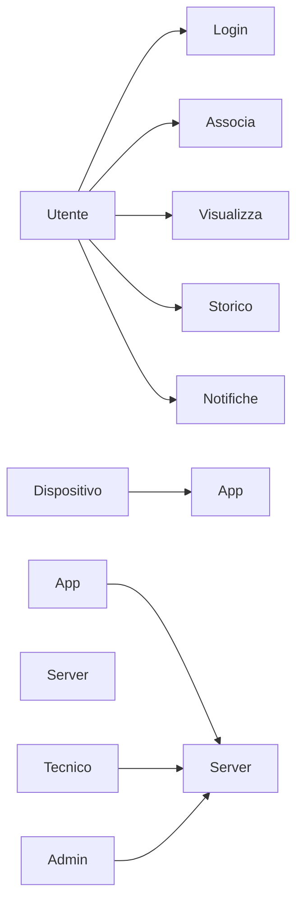
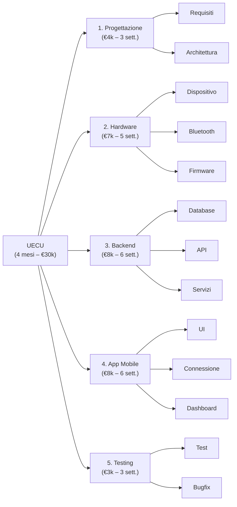
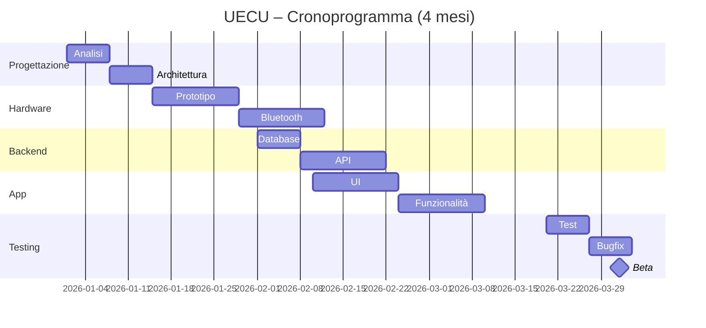

# **UECU**

**Autore:** Denis Karaje

## **Legenda e Navigazione**

1. **[Descrizione e Visione](#descrizione)**
2. **[Analisi di Mercato](#problema)** (Problema, Target, Competitors)
3. **[Specifiche Tecniche](#tecnologie)**
4. **[Analisi dei Requisiti](#analisi-dei-requisiti)** (Dettagli, Elenco e User Stories)
5. **[Modellazione e Prototipazione](#use-case-uml)** (UML e Prototipo)
6. **[Business Strategy](#elevator-pitch-e-business-model)** (Pitch, Business Model, WBS e Gantt)

---

## **Descrizione:**

UECU è una piattaforma composta da **dispositivo fisico + app mobile**, progettata per permettere agli utenti di **monitorare, leggere e gestire i dati elettronici del proprio veicolo** in modo semplice e guidato tramite smartphone.

Il dispositivo si collega al veicolo e comunica via **Bluetooth** con l’app. L’app si connette a un **server centrale** che gestisce veicoli, dati, aggiornamenti, storico operazioni e servizi digitali.

Un modo innovativo per gestire la propria auto: **meno costi, più controllo, più trasparenza**.

> ✨ *Controlla la tua auto in pochi minuti, direttamente dal telefono.*

---

## **Problema**

L’ostacolo principale identificato nel mercato attuale è il seguente:

> La difficoltà nell’accedere ai dati elettronici del proprio veicolo in modo semplice, economico e trasparente.

---

## **Target**

Il servizio si rivolge specificamente a:

- Appassionati di auto  
- Utenti privati  
- Officine ed elettrauti  
- Centri assistenza  
- Preparatori  

---

## **Competitors**

Il panorama attuale offre diverse alternative, ma nessuna integra **hardware + app + cloud + supporto remoto**:

* App OBD generiche  
* Officine tradizionali  
* Strumenti diagnostici professionali  

---

### **Analisi Comparativa**

| 🧩 **Caratteristica** | ⭐ **Importanza** | 🚗 **UECU** | 🔧 **Officina** | 📱 **App OBD** | 🛠️ **Strumenti Pro** |
|---|---|---|---|---|---|
| **Controllo da smartphone** | 🔥 High | 🟢 Completo | 🔴 No | 🟢 Sì | 🔴 No |
| **Storico digitale** | 🔥 High | 🟢 Completo | 🔴 No | 🟠 Limitato | 🟠 Dipende |
| **Supporto remoto** | 🔥 High | 🟢 Sì | 🔴 No | 🔴 No | 🟠 Limitato |
| **Facilità d’uso** | 🔥 High | 🟢 Alta | 🟠 Media | 🟠 Media | 🔴 Bassa |
| **Costo accessibile** | 🔥 High | 🟢 Medio/Basso | 🔴 Alto | 🟢 Basso | 🔴 Alto |
| **Aggiornamenti online** | 🔥 High | 🟢 Sì | 🔴 No | 🟠 Limitato | 🟠 Possibile |
| **Esperienza digitale completa** | 🔥 High | 🟢 Ecosistema | 🔴 No | 🟠 Parziale | 🟠 Tecnica |

---

## **Tagline**

> “La tua auto, i tuoi dati, il tuo controllo.”

---

## **Tecnologie**

Per supportare l’architettura del sistema:

* **App Mobile:** Kotlin / Flutter  
* **Backend:** Node.js (Express) o Java Spring  
* **Database:** PostgreSQL / MongoDB  
* **Autenticazione:** JWT  
* **Comunicazione:** Bluetooth + HTTPS  
* **Cloud:** VPS / AWS / Google Cloud  
* **Firmware:** aggiornabile OTA  
* **Sicurezza:** HTTPS, cifratura dati  

---

## **Analisi dei Requisiti**

### **Descrizione dei requisiti**

La piattaforma consente agli utenti di **registrarsi**, effettuare **login**, associare un dispositivo e collegarlo al veicolo.

L’utente può:

- visualizzare dati del veicolo  
- consultare lo storico  
- ricevere notifiche  
- richiedere assistenza  

Il sistema gestisce tutto tramite backend cloud e database.

---

### **Elenco Riassuntivo Requisiti**

#### **Funzionali**

* Registrazione e login  
* Associazione dispositivo  
* Collegamento Bluetooth  
* Lettura dati veicolo  
* Storico operazioni  
* Notifiche  
* Supporto tecnico remoto  
* Gestione dispositivi  
* Aggiornamento firmware  

---

### **User Story**

| **Attore (Come...)** | **Voglio...** | **In modo da...** |
|---|---|---|
| Utente | registrarmi | accedere al sistema |
| Utente | collegare dispositivo | leggere dati auto |
| Utente | vedere dati | controllare stato |
| Utente | vedere storico | monitorare interventi |
| Utente | ricevere notifiche | essere aggiornato |
| Tecnico | accedere ai dati | fornire supporto |
| Admin | gestire sistema | controllare tutto |

---

#### **Non Funzionali**

* Interfaccia semplice  
* Sistema veloce  
* Alta sicurezza  
* Scalabilità  
* Compatibilità multi-veicolo  

---

#### **Di Dominio**

* Dispositivo associato a utente  
* Dati tracciati e salvati  
* Comunicazioni protette  
* Accesso sicuro  

---

## **Use Case UML**

---

## Prototipo

### Accesso diretto:

- https://uecu.lovable.app

---

## Elevator Pitch

 UECU è una piattaforma composta da dispositivo e app che permette di monitorare i dati del veicolo in modo semplice e digitale. L’utente può controllare la propria auto dal telefono, avere uno storico completo e ricevere assistenza tecnica. UECU rende il controllo del veicolo più moderno, veloce e accessibile.

---

WBS (Work Breakdown Structure)

---

## Cronoprogramma

